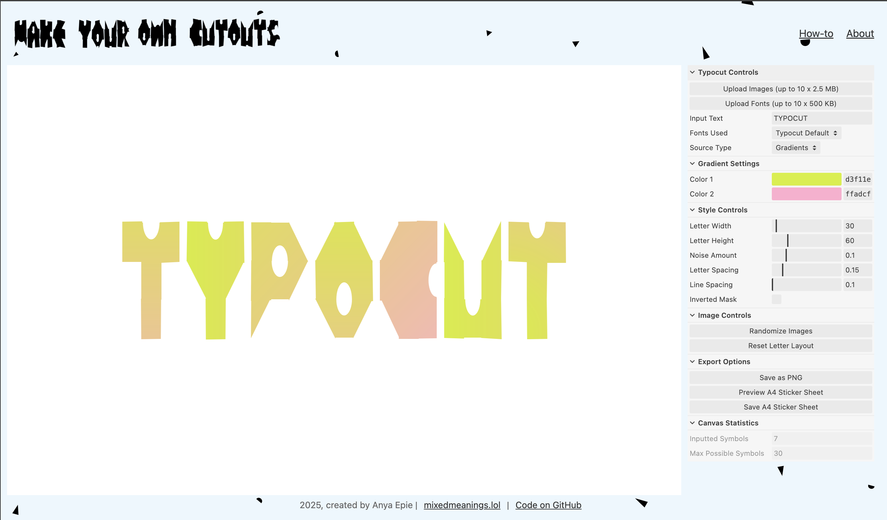
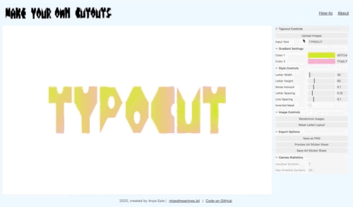
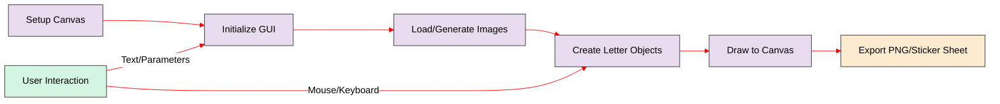

# Typocut: Generative Typography Tool

Typocut is an interactive tool that mixes collages, typography and randomness. Born from a passion for collage and creative coding, it produces typographic designs with noise, randomized image masking and configurable gradients. 

Try it at [typocut.online](https://typocut.online)
(or [https://anyaepie.github.io/typo-cut/](https://anyaepie.github.io/typo-cut/)) 



Created as a capstone project for [Werkstatt Creative Coding course](https://werkstatt.school/creative-coding), Typocut explores how analogue could be emulated by digital and then converted back to analogue.

Each letter is a canvas, randomly cropped from configurable gradients or uploaded images, with adjustable noise and style parameters. Letters are built using strict 3x3 grid with primitives (rectange, triangle, cut-out rectangles, half-circles) that are flipped and rotated as needed - all with noise applied, combining pixel and parametric fonts.

Check out additional details about the process [here](https://www.mixedmeanings.lol/digital/typo-cut) and my other creative coding projects at [mixedmeanings.lol/digital](https://www.mixedmeanings.lol/digital).

## Inspiration

Notable [Coding Train](https://thecodingtrain.com/) tutorials leveraged in this project include:
- [masking images](https://www.youtube.com/watch?v=V-8FE_IQONY)
- [uploading images](https://www.youtube.com/watch?v=rO6M5hj0V-o)
- [hosting p5js on github pages](https://www.youtube.com/watch?v=ZneWjyn18e8)
- [instance mode](https://www.youtube.com/watch?v=Su792jEauZg) - after watching this video I decided not to go there :)

GUI is created using [lil-gui](https://lil-gui.georgealways.com/#) by [George Michael Brower](https://georgealways.com/).

## Key Features

<div align="center">
    


*(quick demo gif - click on the file to watch the animation if not working automatically)*

</div>

The user can type their own text (note the dynamically calculated character limit depending on the canvas size, letter size and line spacing). Direct cut-out is applied by default, yet the user can choose the inverted mask, when the letters are cut-out from the underlying rectangles.

Letters can be repositioned with a mouse and saved as transparent PNG.

Cutting out letters from the gradients is a default option, gradients could be configured in the GUI. To use custom images, the user needs to upload the images first (not more than 15, JPG, JPEG, PNG each less than 2MB) and chose "Uploaded Images" in the dropdown menu.

A4 alphabet sheet can be previewed and saved as PNG separately, with letter configuration picked up from the main screen. The alphabet letter quantities are defined based on the standard frequency distribution for the English alphabet ([wiki](https://en.wikipedia.org/wiki/Letter_frequency)). Saved transparent PNG could be used to print out the sticker sheet.

## Architecture Overview


Typocut is built with p5.js (single sketch - for multiple sketches running in parallel you can explore "instance mode", but I didn't) and follows a modular design pattern, here are the modules at a glance:

```mermaid
%%{init: {'theme': 'base', 'themeVariables': { 'primaryColor': '#ffffff', 'primaryTextColor': '#000000', 'primaryBorderColor': '#000000', 'lineColor': '#ff0000', 'secondaryColor': '#ffffff', 'tertiaryColor': '#ffffff' }}}%%
graph TB
    %% Core Components
    subgraph Core[Core Components]
        direction LR
        Constants[Constants.js\nGlobal variables] -.-> CoreFunctions[CoreFunctions.js\nUtility functions]
        Sketch[sketch.js\nInitialization & loop]
    end
    
    %% Image Processing
    subgraph Image[Image Handling]
        direction TB
        ImgHandling[ImageHandling.js] --> Gradients[Create gradients]
        ImgHandling --> ProcessUploads[Process images]
        FileHandling[FileHandling.js] --> FileInput[Hidden file input]
        FileHandling --> SaveOutput[Save PNG]
    end
    
    %% Letter Processing 
    subgraph Letter[Letter Processing]
        direction TB
        LetterObj[LetterObject.js] --> Properties[Position & dimensions]
        LetterRender[LetterRendering.js] --> LetterDef[Letter definitions]
        LetterRender --> Masking[Pixel masking]
        LetterManage[LetterManagement.js] --> Layout[Calculate layout]
    end
    
    %% User Interaction
    subgraph UI[User Interface]
        direction TB
        GUISetup[GUI.js] --> Controls[Parameter controls]
        GUISetup --> SourceType[Image source toggle]
        Interaction[InteractionHandlers.js] --> Mouse[Drag letters]
    end
    
    %% Export Features
    subgraph Export[Export Features]
        direction TB
        Sticker[StickerSheet.js] --> Distribution[Letter distribution]
        Sticker --> SaveSheet[Save sticker sheet]
    end
    
    %% Connections between components
    Constants -.-> All[All modules]
    Core --> Image
    Core --> Letter
    Core --> UI
    Core --> Export
    GUISetup --> ImgHandling
    Interaction --> LetterManage
    LetterObj --> LetterRender
    ImgHandling --> LetterManage
    FileHandling --> ImgHandling
    LetterManage --> Sticker

    classDef core fill:#f9d5e5,stroke:#000000,stroke-width:1px,color:#000000;
    classDef image fill:#e6f2ff,stroke:#000000,stroke-width:1px,color:#000000;
    classDef letter fill:#d3f0ee,stroke:#000000,stroke-width:1px,color:#000000;
    classDef ui fill:#d5f5e3,stroke:#000000,stroke-width:1px,color:#000000;
    classDef export fill:#fdebd0,stroke:#000000,stroke-width:1px,color:#000000;
    classDef default fill:#ffffff,stroke:#000000,stroke-width:1px,color:#000000;

    class Constants,CoreFunctions,Sketch,Core core;
    class ImgHandling,FileHandling,Gradients,ProcessUploads,FileInput,SaveOutput,Image image;
    class LetterObj,LetterRender,LetterManage,Properties,LetterDef,Masking,Layout,Letter letter;
    class GUISetup,Interaction,Controls,SourceType,Mouse,UI ui;
    class Sticker,Distribution,SaveSheet,Export export;

```


Here's how the main components work together:

### Core Files

- **Constants.js**: Contains global settings, state variables, and utility functions used throughout the application.
- **sketch.js**: The main p5.js sketch file that initializes the canvas and handles the drawing loop.
- **CoreFunctions.js**: Houses utility functions for calculating layout and debugging image sources.

### Image Management

- **ImageHandling.js**: Responsible for creating gradient placeholders and processing uploaded images.
- **FileHandling.js**: Handles file uploads, input setup, and saving PNG output.

### Letter Management & Rendering

- **LetterObject.js**: Class definition for letter objects with positioning, dimensions, and rendering properties.
- **LetterRendering.js**: Contains letter definitions as cell codes and masking/rendering functions.
- **LetterManagement.js**: Handles creating, updating, and organizing letter objects on the canvas.

### User Interface & Interaction

- **GUI.js**: Sets up the control panel using lil-gui library and manages GUI state.
- **InteractionHandlers.js**: Manages mouse and keyboard interactions for manipulating letters.

### Export Features

- **StickerSheet.js**: Handles generating sticker sheets for printing on A4 paper.

## Application Flow

1. **Initialization**:
   - Canvas setup in the browser window
   - GUI controls initialization
   - Initial gradient images are generated
   - Letter objects created based on default text

2. **User Interaction Loop**:
   - User inputs text or modifies parameters via GUI
   - Letters are updated with new parameters
   - Mouse interaction allows for direct manipulation of letter positions
   - Image source can be toggled between gradients and uploaded files

3. **Rendering Process**:
   - Each letter is rendered using its character definition
   - Images are applied through masking technique
   - Random noise is applied to letter shapes for visual interest
   - Canvas is redrawn when parameters change

4. **Export Options**:
   - Export as PNG with current layout
   - Generate A4 sticker sheet with optimized letter distribution

## Where I've had the most fun

### Mask Inversion System

When initially starting with a single (direct) mask, I realised that it would be cool to have an inverse mask. Initially I've wrote two separate functions, yet after seeing almost all the code being repeated, I've introduced a single function with boolean "inverted" parameter:

```javascript
// From LetterRendering.js
function drawLetterWithMask(char, x, y, cw, ch, imageIndex, imageSectionPos, inverted) {
    // ...
    letterMask = createGraphics(totalWidth, totalHeight);
    letterMask.noStroke();
    if (inverted) { 
        letterMask.background(255); letterMask.fill(0);
    } else {
        letterMask.background(0); letterMask.fill(255);
    }
    // ...
}
```

### Hidden File Upload Implementation

I didn't like  the look of the system upload file button, so a hidden file input element is triggered by a (nicely looking) GUI button, providing a seamless user experience while maintaining full control over the upload process:

```javascript
// From FileHandling.js
function setupFileInput() {
  fileInputElement = document.createElement('input');
  fileInputElement.type = 'file';
  fileInputElement.multiple = true;
  fileInputElement.accept = 'image/jpeg,image/png,image/jpg';
  fileInputElement.style.position = 'absolute';
  fileInputElement.style.top = '-1000px'; // Position off-screen
  fileInputElement.style.opacity = '0';
  fileInputElement.style.pointerEvents = 'none';
  document.body.appendChild(fileInputElement);
  
  fileInputElement.onchange = function(event) {
    // Process selected files...
  };
}
```

### Primitive Drawing Reuse

Overall, each letter is defined by a sequence of the predefined codes in a 3×3 grid, allowing for complex letter shapes with minimal definition data. 

When prototyping, I initially wrote all primitive drawing functions independently, yet after refactored into four patterns (half-arc, rectangle, rectangle with a triangle cut-out, rectangle with a half-arc cut-out, traingle). Functions intake rotation, noise (defined globally, per letter), flipping.

As letter's width and height are independent, I switch length and width for rectangles with the half-circle cut-out, if they are rotated 90 degrees. 
Noise calculations for all the primitives aim to make outer dimensions of the primitives bigger/smaller without impacting the inner pars to avoid holes as I didn't like the effect.

A simple broker function converts each letter definition into a relevant primitive drawing function:

```javascript
// From LetterRendering.js
function drawCellPrimitive(code, x, y, w, h, pg) {
    if (code === "00") return;
    let noise = noiseAmount;

    if (code === "01") { drawArcPrimitive(x, y, w, h, noise, 0, pg); }
    else if (code === "02") { drawArcPrimitive(x, y, w, h, noise, PI, pg); }
    else if (code === "10") { drawRectanglePrimitive(x, y, w, h, noise, pg); }
    // ...and so on
}
```

### A4 Sticker Sheet Letter Distribution Algorithm

The sticker sheet generator uses a simple frequency-based algorithm to determine which letters should appear more often based on typical English usage as per [Wikipedia](https://en.wikipedia.org/wiki/Letter_frequency). This ensures that when creating stickers, the most commonly used letters in English appear more frequently, making the sticker set more practical for real-world use:

```javascript
// From StickerSheet.js
function generateLetterSequence(maxLetters) {
    const freqLetters = ["E", "T", "A", "O", "I", "N", "S", "H", "R", "D", "L", "C", "U", "M", "W", "F", "G", "Y", "P", "B", "V", "K", "J", "X", "Q", "Z"];
    const frequency = [12, 9, 8, 8, 7, 7, 6, 6, 6, 4, 4, 3, 3, 2, 2, 2, 2, 2, 2, 1, 1, 1, 1, 1, 1, 1];
    // ...

    // Ensure all letters appear at least once
    let counts = new Array(26).fill(0);
    for (let i = 0; i < 26; i++) counts[i] = 1;
    
    // Distribute remaining slots proportionally to letter frequency
    let remaining = maxLetters - 26;
    // ...

    // Build the final sequence
    let sequence = "";
    for (let i = 0; i < 26; i++) {
        let letter = String.fromCharCode('A'.charCodeAt(0) + i);
        sequence += letter.repeat(counts[i]);
    }
    
    return sequence.substring(0, maxLetters);
}
```

## What is not working as I want it to - Crisp Cut-outs

As of now, I haven't been able to resolve the issues with how standart mask() function is applied (copy to copy), so I'm using direct pixel manipulation which most likely creates fuzzy corners (and I don't like it!):
```javascript
// From LetterRendering.js
// Apply Manual Mask via Pixel Manipulation
letterMask.loadPixels();
resultSection.loadPixels();

for (let i = 0; i < letterMask.pixels.length; i += 4) {
    let maskValue = letterMask.pixels[i]; // Mask brightness (0 or 255)
    resultSection.pixels[i]     = imgSection.pixels[i];
    resultSection.pixels[i + 1] = imgSection.pixels[i + 1];
    resultSection.pixels[i + 2] = imgSection.pixels[i + 2];
    resultSection.pixels[i + 3] = maskValue; // Alpha from mask
}
resultSection.updatePixels();
```
This approach gives precise control over the masking process, though I suspect it introduces some pixelation issues that remain to be solved for crisper letter edges.

## AI-Assisted Development

This is [p5js framework](https://p5js.org/) port from the original [Processing Java](https://processing.org/) code I've developed locally by combining several homework assignments from the course. 

I've used [Google Gemini 2.5 @ Google AI studio](https://aistudio.google.com) with 1M tokens [long context](https://cloud.google.com/vertex-ai/generative-ai/docs/long-context) to conduct the port from Processing Java into p5js. This model was used mainly because of the longest context window available at the market for free (ha-ha!) at that point of time and the fact that I was aiming mainly for syntaxis-only changes.

NB! I've used "chain of thought"-like approach to work with Gemini:
- asked the model to analyse the code and outline the code flow as it sees it and ask any questions that are not clear
- confirmed the flow understanding from my side, asked how the code structure could look like, aiming for readability, [DRY](https://en.wikipedia.org/wiki/Don%27t_repeat_yourself) and clear "blast radius" for code changes, providing context that it's: a) a capstone project, b) some functionality is yet to be developed (with examples); c) the finar result will be hosted on GitHub Pages; d) I know nothing about front-end and not willing to invest in that now.
- iterated on the code structure, and updated project documents and overall system prompts with the agreed context when was satisfied to bring the model to the final context
- asked the model to start converting the code from Processing Java to P5JS as per agreed code structure, file by file, without changing any logic, just the syntaxis and provide me both the new code file and explanation of the changes introduced so I can monitor. My "rule of thumb" was to have 250 lines or less per file.

I manually copied code files converted by the model to p5js.org to keep iterating on gui and file upload. Alternative option was to copy all files on github, sync the repo locally and use VSCode + Copilot to keep iterating, yet I really liked ability to quickly iterate (save-play-stop) available through web-intefrace on p5js.org.

Website (index.html) is responsibly (?) vibe-coded with Claude 3.7 (and cross evaluated with Gemini) as I'm an absolute noob when it comes to front-end.

## Contacts

You can contact me on [LinkedIn](https://www.linkedin.com/in/epanya/) or through the [contacts form on my website](https://www.mixedmeanings.lol/contact)
